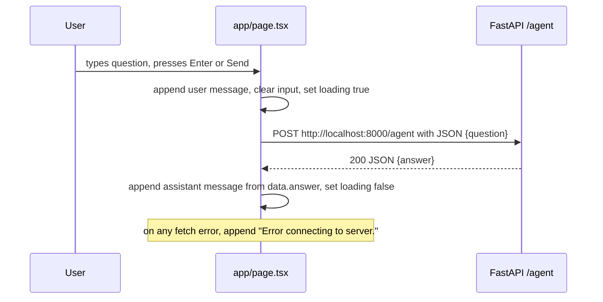

# Next.js frontend

The `greek_resilient_rag/` directory holds a standalone **Next.js 16.2.6** web application built on the **App Router**. It is a thin presentation layer: a single chat page that gathers a user question and dispatches it to the FastAPI backend's `/agent` endpoint. It performs no retrieval, LLM, or tool logic itself — all analysis happens server-side, and the frontend only renders the returned answer.

> **Next.js 16 caveat.** `AGENTS.md` warns that this version ships breaking changes versus earlier Next.js releases — APIs, conventions, and file structure may differ from older training material. Treat the app-router structure and font metadata APIs as the source of truth; do not assume pre-16 behavior.

## Application shape

The app is the default `create-next-app` scaffold, trimmed to one page:

- `app/layout.tsx` — root layout; loads Geist fonts, sets metadata, wraps children.
- `app/page.tsx` — the only route, a client-component chat UI.
- `app/globals.css` — Tailwind 4 import plus theme variables consumed by the layout.
- `next.config.ts` — present but empty/default (no custom config).
- `public/` — static assets shipped by the scaffold (SVGs, favicon).

## Layout and fonts

`app/layout.tsx` is the App Router root layout. It imports the **Geist** and **Geist Mono** variable fonts from `next/font/google`, exposing them as the CSS variables `--font-geist-sans` and `--font-geist-mono`, applies them to the `<html>` element alongside `antialiased`, and gives `<body>` a full-height flex column. It also exports the default `metadata` object (title "Create Next App", description "Generated by create next app") and imports `./globals.css`, which is where Tailwind's `@import "tailwindcss"` directive and the `@theme inline` mapping from the font variables to `--font-sans` / `--font-mono` live.

## The chat page

`app/page.tsx` is a **client component** (`'use client'`) that implements the entire UI. It is the only user-facing route in the app and is the sole consumer of the backend `/agent` endpoint.

### State and rendering

The component holds three pieces of local state:

- `messages` — an array of `{ role: 'user' | 'assistant', text: string }` rendered as a scrolling chat transcript.
- `input` — the current value of the text field.
- `loading` — a boolean that disables the send button and shows a "Σκέφτομαι..." ("thinking…") pulse indicator while a request is in flight.

The transcript is rendered in a fixed-height `overflow-y-auto` container; user messages are styled with one background and assistant messages with another, each prefixed with a role label in Greek ("Εσύ" for the user, "Agent" for the assistant). The input field's `onKeyDown` fires `sendMessage` on Enter, and the "Αποστολή" ("Send") button calls it on click.

### Request flow

`sendMessage` is the page's only network interaction. It appends the user's message immediately, clears the input, sets `loading`, then performs a browser `fetch`:

1. `POST` to the hard-coded URL `http://localhost:8000/agent`.
2. Request body is `JSON.stringify({ question: input })` — a single `question` field.
3. On a successful response, it reads `data.answer` and appends it as an assistant message.
4. On any thrown error, it appends a fixed assistant message: `"Error connecting to server."`
5. `loading` is reset in `finally`.

Caption: The chat page's single request — it posts `{question}` to the backend `/agent` endpoint and renders the returned `answer`; no other backend route is used.

### Endpoint contract

The page depends on the backend `/agent` route accepting a JSON body of the form `{"question": "<string>"}` and responding with JSON of the form `{"answer": "<string>"}`. It does **not** call `/ask`; the frontend is wired exclusively to the agent path. Because the backend reads the last agent message and may unwrap a list-of-objects content shape into a plain string before returning it, the frontend can rely on `data.answer` being a displayable string.

## CORS coupling

This frontend is the reason the backend enables CORS at all, and the coupling is specific and narrow:

- The FastAPI backend (`main.py`) registers `CORSMiddleware` with `allow_origins=["http://localhost:3000"]`, `allow_methods=["*"]`, and `allow_headers=["*"]`.
- `http://localhost:3000` is the default Next.js dev-server origin, which is exactly the address this app runs on during `npm run dev`.

Consequences:

- The frontend's hard-coded `http://localhost:8000/agent` target and the backend's `http://localhost:3000` allowed origin are a matched pair. Changing the frontend dev port, the fetch URL, or the backend `allow_origins` independently breaks the cross-origin request.
- The frontend has no server-side proxy; the browser makes the cross-origin POST directly, so the backend CORS policy is load-bearing rather than incidental.

## Configuration and toolchain

### `next.config.ts`

`next.config.ts` imports the `NextConfig` type but exports an empty configuration object (`{ /* config options here */ }`). There is no `rewrites`, `headers`, `output`, or environment wiring here — the backend URL is hard-coded in `page.tsx`, not derived from config.

### `package.json` scripts

| Script | Command | Purpose |
| --- | --- | --- |
| `dev` | `next dev` | Start the dev server (default port 3000) |
| `build` | `next build` | Production build |
| `start` | `next start` | Run the production build |
| `lint` | `eslint` | Lint the project (flat config in `eslint.config.mjs`) |

### Stack versions

- **Next.js** `16.2.6` (App Router, breaking-change version per `AGENTS.md`).
- **React** / **react-dom** `19.2.4`.
- **Tailwind CSS** `^4` via `@tailwindcss/postcss`, wired through `postcss.config.mjs` and the `@import "tailwindcss"` directive in `globals.css`.
- **TypeScript** `^5` (strict, `moduleResolution: "bundler"`, `jsx: "react-jsx"`).
- **ESLint** `^9` with `eslint-config-next` core-web-vitals and typescript configs, via the flat config in `eslint.config.mjs`.

## Relationships

- **Backend `/agent`** — the only API the frontend calls; see the Architecture overview for the agent's tool-driven behavior and the `/ask` RAG path this UI does not use.
- **External services** — the frontend itself calls no third-party services directly; all external integration (Gemini, Chroma) is behind the backend.
- **Runbook** — local operation assumes `npm run dev` on port 3000 with the FastAPI backend on port 8000; the CORS allowlist ties these two ports together.
