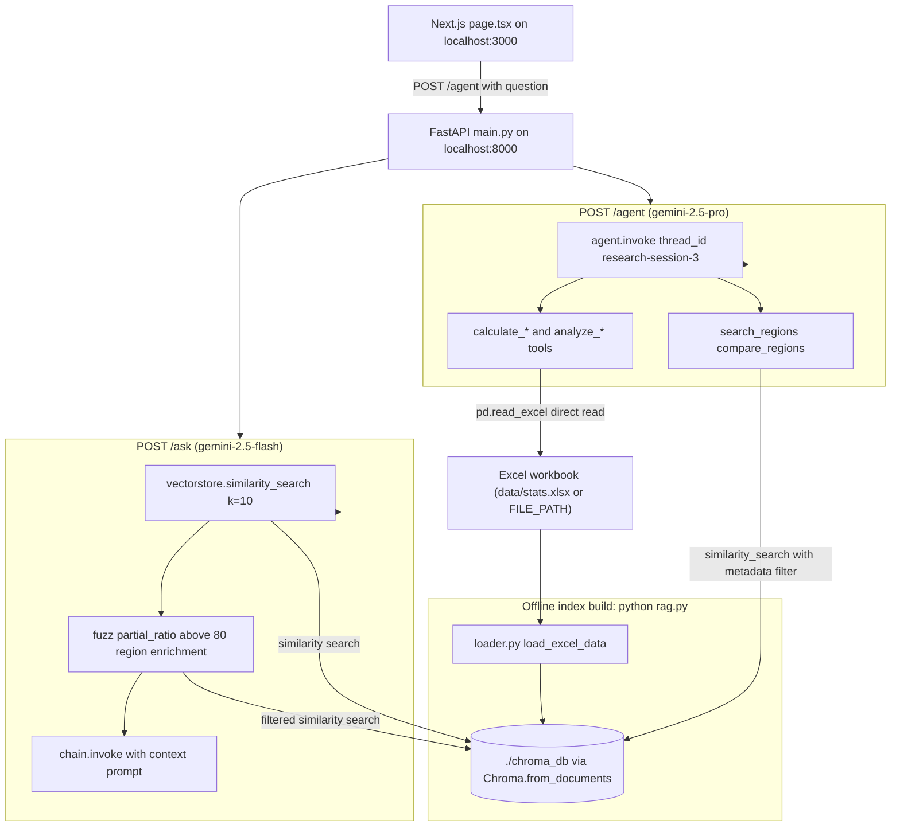

# Architecture overview

This project is a single-process **FastAPI** application backed by a local **ChromaDB** vector store and an **Excel workbook** as the source of truth. It exposes two user-facing API paths and is fronted by a thin **Next.js** chat UI:

- `POST /ask` — a retrieval-augmented generation (RAG) path that reads ChromaDB and answers with **Gemini 2.5 Flash**.
- `POST /agent` — a tool-driven research path that runs a **LangChain/LangGraph agent** with workbook-reading tools and answers with **Gemini 2.5 Pro**.

The central design distinction is where each path gets its facts: `/ask` reads the prebuilt ChromaDB index of workbook chunks, while `/agent` tools mostly read the workbook directly with pandas to compute, compare, and classify resilience metrics.



*Figure: end-to-end flow. The offline `rag.py`/`loader.py` pipeline turns the workbook into `./chroma_db`; `POST /ask` reads that index under Gemini Flash; `POST /agent` drives a Gemini Pro agent whose calculation tools read the workbook directly (and whose search tools read the index); the Next.js page posts to `/agent` over CORS.*

## System shape

The backend is `main.py`, a FastAPI app. It constructs the Gemini chat model, a `StrOutputParser` chain, the Chroma retriever, and the two endpoints. The agent itself is defined in `agent.py`, which `main.py` imports. The frontend is a standalone Next.js app under `greek_resilient_rag/` that only posts to the backend `/agent` endpoint.

Two parallel QA subsystems coexist deliberately:

- **RAG path** (`/ask`): good for quick answers grounded in semantically similar workbook chunks already embedded in ChromaDB.
- **Agent path** (`/agent`): good for calculations, comparisons, and region-specific resilience diagnostics where direct spreadsheet access is more reliable than vector recall.

## Main components

- **`main.py`** — wires FastAPI, the CORS middleware, the `gemini-2.5-flash` chat chain, the Chroma retriever (`./chroma_db`), and the `/ask` and `/agent` endpoints. It imports the `agent` object from `agent.py`.
- **`agent.py`** — defines the `gemini-2.5-pro`-backed LangChain agent, its `MemorySaver` checkpointer, the research `system_prompt`, and the workbook-reading/Chroma-reading tools. Exposes the constructed `agent` for `main.py` to invoke.
- **`loader.py`** — `load_excel_data(file_path, sheet_label)` converts one workbook sheet into `langchain_core.documents.Document` objects carrying `region`/`indicator`/`era`/`source` metadata.
- **`rag.py`** — the offline indexing script: iterates the six configured sheets through `loader.py` and persists the combined chunks to `./chroma_db` via `Chroma.from_documents(...)`.
- **`cluster_analysis.py`** — an offline analysis/plotting script that derives the KMeans cluster visualizations from hardcoded region scores; not part of the runtime.

## Data flow and the source-of-truth invariant

The Excel workbook is the system's source of truth; ChromaDB is a local rebuilt artifact.

1. `rag.py` reads the workbook from `FILE_PATH` (default `data/stats.xlsx`) and iterates six sheet labels: `Normal Οικον Βάση`, `Normal Οικον Βάση - Crisis`, `Normal Οικον Βάση - COVID`, `Normal Κοινων Βάση`, `Normal Κοινων Βάση - Crisis`, `Normal Κοινων Βάση - COVID`.
2. `loader.load_excel_data` normalizes column headers, locates the national row (`Ελλάδα`), and emits one `Document` per region × indicator × era. Eras are `Expansion (Προ Κρίσης)` (2005–2008), `Crisis (Κρίση)` (2009–2013), and `Recovery (Ανάκαμψη)` (2014–2023); each document's `page_content` pairs regional values with the corresponding national values.
3. `rag.py` persists all sheets' documents to `./chroma_db` through `Chroma.from_documents(documents=all_docs, persist_directory="./chroma_db")`.
4. At startup, `main.py` loads the existing index with `Chroma(persist_directory="./chroma_db")`. There is no runtime embedding step — if the workbook changes, `python rag.py` must be rerun to rebuild the index.

## The /ask retrieval path

`POST /ask` receives a `Question` (`{ question: str }`) and answers from Chroma plus Gemini Flash:

1. `vectorstore.similarity_search(message.question, k=10)` retrieves the top 10 chunks.
2. It collects the `region` values already found and runs a fuzzy enrichment loop over a hardcoded list of 13 Greek regions: for each region where `thefuzz.fuzz.partial_ratio(region, question)` exceeds 80 and the region is not already in the result set, it runs a second `similarity_search(... k=5, filter={"region": region})` and appends those chunks.
3. The combined chunk contents become the `Context` of a prompt that instructs the model to act as a resilience data analyst, compare the region to the national figures, and answer in at most five sentences.
4. The `llm | parser` chain (Gemini Flash + `StrOutputParser`) produces the answer returned as `{"answer": ...}`.

This path never touches the workbook directly — it depends entirely on what `rag.py` embedded into `./chroma_db`.

## The /agent tool-driven path

`POST /agent` receives the same `Question` shape and invokes the LangChain agent:

```python
result = agent.invoke(
    {"messages": [{"role": "user", "content": message.question}]},
    config={"configurable": {"thread_id": "research-session-3"}},
)
answer = result["messages"][-1].content
```

The agent is built with `create_agent(llm, tools=available_tools, system_prompt=system_prompt, checkpointer=memory)`, where `llm` is `gemini-2.5-pro` and `memory` is a LangGraph `MemorySaver` (in-process checkpointer keyed by `thread_id`). The `system_prompt` directs a multi-phase research protocol — exploratory, diagnostic, synthesis — ending with a call to `save_finding` to archive the verdict.

The agent's tools split across the two data sources:

- **ChromaDB-reading tools** — `search_regions` and `compare_regions` run `vectorstore.similarity_search` with a `$and` metadata filter on `region`/`indicator`/`era` (after mapping user era terms like `crisis`/`expansion`/`recovery` and their Greek forms to canonical era names). These are the only tools that reuse the `./chroma_db` index.
- **Workbook-reading tools** — `calculate_percent_change`, `calculate_resilience_score`, `calculate_rti_score`, `calculate_recovery_speed`, `analyze_socioeconomic_coupling`, `calculate_structural_shift`, `calculate_rtix_score`, `calculate_crisis_comparison`, and `calculate_vulnerability_index` all call `pd.read_excel(file_path, sheet_name=...)` directly and rely on fixed sheet/column labels. This is the bulk of the agent's analytical capability, and it is what makes the agent path "tool-driven": it computes from raw rows rather than recalling embedded chunks.

All tools apply fuzzy matching (`thefuzz.process.extractOne`, score threshold 70) to map user phrasing onto the exact region names in the workbook, and the `system_prompt` mandates Greek region names.

## Frontend integration and CORS

The Next.js frontend (`greek_resilient_rag/app/page.tsx`) is a client-component chat UI. On submit it performs:

```ts
const res = await fetch('http://localhost:8000/agent', {
  method: 'POST',
  headers: { 'Content-Type': 'application/json' },
  body: JSON.stringify({ question: input }),
});
```

It posts only to `/agent` (never `/ask`) and renders `data.answer`. Cross-origin calls from `localhost:3000` to `localhost:8000` are enabled by the FastAPI CORS middleware, which allows the single origin `http://localhost:3000` with all methods and headers. The frontend holds no retrieval, LLM, or tool logic — all analysis is server-side.

## Design implications and invariants

- **ChromaDB is a rebuild artifact.** It is local and expected to be regenerated from the workbook via `python rag.py`; it is not a remote source of truth. Startup assumes a populated `./chroma_db`.
- **Sheet and column naming is strict.** Both `rag.py` (the six sheet labels) and the workbook-reading agent tools (fixed columns like `Resistance (2008-2013)`, `% Regional Change 2013-2019`) assume exact Greek sheet/column labels. Workbook drift breaks both indexing and tools.
- **Fuzzy matching softens input but not the data model.** `thefuzz` maps user phrasing to regions/indicators; the underlying workbook columns and the ChromaDB metadata filters remain exact.
- **Model split is intentional.** `/ask` uses `gemini-2.5-flash` for fast, cheap grounded answers; `/agent` uses `gemini-2.5-pro` for the longer multi-tool reasoning loop the research protocol requires.
- **Agent memory is in-process.** `MemorySaver` with `thread_id` "research-session-3" provides conversational continuity within a running process but is not persisted across restarts.

## Source anchors

- `main.py` — FastAPI app, CORS, `/ask` and `/agent` endpoints, Gemini Flash chain, Chroma loader.
- `agent.py` — Gemini Pro agent, tools, system prompt, checkpointer.
- `loader.py` — `load_excel_data` document factory.
- `rag.py` — offline `./chroma_db` builder.
- `greek_resilient_rag/app/page.tsx` — Next.js chat page posting to `/agent`.
