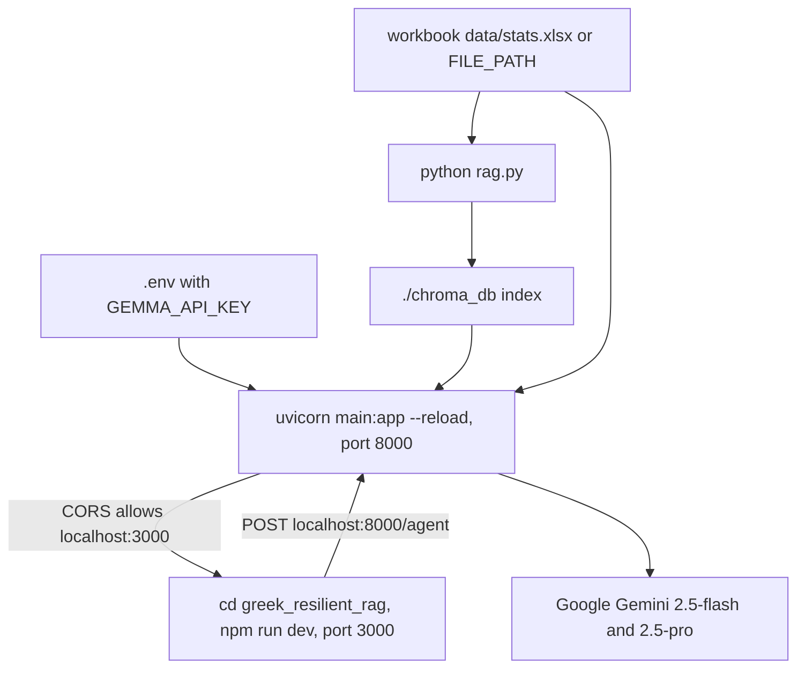

# Operations / runbook

The system has two subsystems that run together locally: a Python FastAPI backend (repository root) and a Next.js frontend (`greek_resilient_rag/`). The backend serves `POST /ask` and `POST /agent`; the frontend is a chat UI that posts to `/agent`. Both depend on a local Excel workbook and a local ChromaDB index, plus a Google Gemini API key.

## Local dev topology



The offline indexer, the FastAPI backend, and the Next.js frontend wired together for local development.

## Backend setup

1. Create and activate a Python virtual environment.
2. Install dependencies: `pip install -r requirements.txt`.
3. Create a `.env` with `GEMMA_API_KEY=<your Gemini key>`.
4. Place the workbook at `data/stats.xlsx`, or set `FILE_PATH` to its location.
5. Build the vector index: `python rag.py`. This reads six sheets from the workbook and writes `./chroma_db`.
6. Start the API: `uvicorn main:app --reload` (port 8000 by convention).

`main.py` loads `.env` via `load_dotenv()` and constructs `ChatGoogleGenerativeAI(model="gemini-2.5-flash", google_api_key=os.getenv("GEMMA_API_KEY"))`. It opens the existing store with `Chroma(persist_directory="./chroma_db")` at import time, so the store must already exist before the server starts.

## Frontend setup

The frontend lives in `greek_resilient_rag/` and is a Next.js app (Next 16, React 19):

```bash
cd greek_resilient_rag
npm install
npm run dev
```

`npm run dev` runs `next dev` on port 3000. The page (`app/page.tsx`) is a client component that `fetch`es `http://localhost:8000/agent` with `{ question }`. Because the backend's CORS middleware only allows `http://localhost:3000`, the frontend must run on port 3000 or the browser requests will be blocked. `npm run build` / `npm run start` produce a production build, and `npm run lint` runs ESLint.

## Environment variables

- `GEMMA_API_KEY` — Google Gemini API key. Read by `main.py` (for `/ask`) and `agent.py` (for the research agent); each module calls `load_dotenv()` to load `.env`. There is no fallback, so LLM calls fail without it.
- `FILE_PATH` — optional override for the workbook path. It defaults to `data/stats.xlsx` in `rag.py` and `agent.py`. `loader.py` receives the path as an argument from its callers, so it inherits whatever `FILE_PATH` resolves to.

## Docker

The `Dockerfile` builds a single-backend image:

- Base `python:3.11-slim`; installs `requirements.txt`; copies the app; exposes `8000`.
- Default command: `uvicorn main:app --host 0.0.0.0 --port 8000` (no `--reload`).

Operational caveats for the container:

- The image does **not** run `rag.py`, so `./chroma_db` is not built during the image build. `.dockerignore` also excludes `chroma_db`, so a prebuilt index is not baked in either. The store must be volume-mounted or rebuilt inside the container before the app can answer queries.
- `.dockerignore` excludes `.env`, so `GEMMA_API_KEY` must be supplied at runtime (env var / secret), not baked into the image.
- The workbook (`data/`) is gitignored and therefore usually absent from the build context; if the agent tools need raw workbook access, mount it at runtime and set `FILE_PATH`.

## Rebuild steps

The ChromaDB index is a build-time artifact, not regenerated at runtime. Rebuild it whenever the workbook changes:

1. Confirm the workbook is present at `FILE_PATH` (or `data/stats.xlsx`).
2. Run `python rag.py`.
3. Restart the backend so it reopens the fresh `./chroma_db`.

`rag.py` enumerates exactly six sheet labels (`Normal Οικον Βάση`, `Normal Οικον Βάση - Crisis`, `Normal Οικον Βάση - COVID`, and the three `Κοινων` equivalents), chunks each via `load_excel_data`, and stores all documents in `./chroma_db`.

## Common failures

### Missing workbook
If `data/stats.xlsx` (or `FILE_PATH`) is absent, `pandas.read_excel(...)` in `loader.py` and every `agent.py` tool that reads the workbook will raise. `rag.py` will also fail before producing any index. Provide the file or set `FILE_PATH` to a valid path.

### Missing or stale ChromaDB index
`main.py` and `agent.py` open `./chroma_db` at startup / tool time. If the directory is missing, `/ask` retrieval and the `search_regions`/`compare_regions` tools fail; if it is stale relative to the workbook, answers reference outdated data. Rebuild with `python rag.py` after any workbook change.

### Sheet or column drift
The loader and the agent tools assume fixed sheet names and exact column labels (e.g. `Resistance (2008-2013)`, `Recovery (2013-2019)`, `% National Change 2013-2019`). If the workbook schema changes, verify `loader.py`, `rag.py`, and the `agent.py` tools together: a column rename breaks the tools with a `KeyError` or a fuzzy mismatch, while a sheet rename breaks both indexing and tool reads.

### Fuzzy-match surprises
`main.py` uses `fuzz.partial_ratio` (threshold >80) to detect Greek regions in a question, and `agent.py` tools use `process.extractOne` (threshold >70) to map user phrasing to workbook regions/indicators. This is forgiving but can silently pick the wrong region when labels are similar or workbook labels drift; sanity-check matched regions when results look off.

## CI

The only committed GitHub workflow is `.github/workflows/openwiki-update.yml`, the OpenWiki documentation refresh. It runs on a monthly schedule (`cron: '0 6 1 * *'`) and on `workflow_dispatch`, installs `openwiki` globally, runs `openwiki code --update --print` with the OpenRouter provider (model `z-ai/glm-5.2`), and opens a `docs: update OpenWiki` pull request via `peter-evans/create-pull-request`. The older `tests.yml` CI that ran `pytest test_loader.py` has been removed.

## Gitignored local artifacts

The root `.gitignore` keeps these out of version control, so they are local-only and must be regenerated or supplied per machine:

- `venv/`, `.venv/` — Python virtual environments
- `.env` — holds `GEMMA_API_KEY` (and optionally `FILE_PATH`)
- `data/` — the workbook, e.g. `stats.xlsx`
- `chroma_db/` — the built vector index
- `__pycache__/`, `*.pyc`
- `findings.md`, `literature_synthesis.md` — generated research notes (the agent's `save_finding` tool appends to `findings.md`)
- `cluster_radar.png`, `cluster_scatter.png` — clustering plots from `cluster_analysis.py`
- `deepresearch.py`, `test_loader.py` — local scripts/tests not committed

The frontend `.gitignore` excludes `node_modules`, `.next/`, `.env*`, etc.

## Helpful checks

- After workbook or schema changes, rebuild the index: `python rag.py`.
- If `test_loader.py` exists locally, run `pytest test_loader.py` (it is gitignored, so it is not present in a fresh clone).
- Sanity-check `/ask` and `/agent` after changing the data schema, the region list, or the agent tools.
- Confirm the frontend is on port 3000 if the browser shows CORS errors against the backend.
