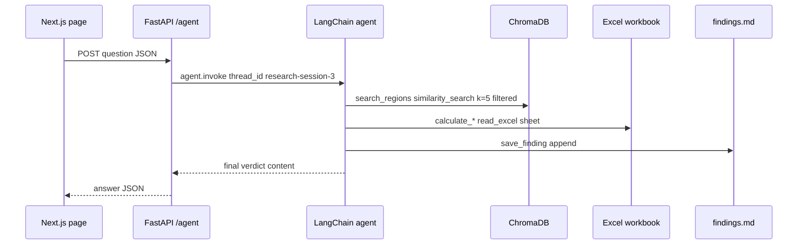
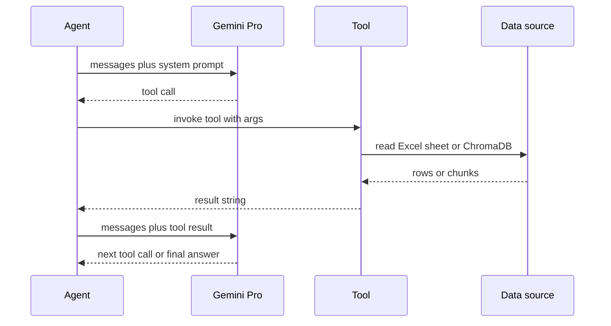

# Workflows

The system has one offline preparation workflow (building the local vector index), two runtime query workflows (`/ask` RAG and `/agent` tool-driven research), a thin frontend interaction loop, and two standalone offline analysis scripts. The Excel workbook is the source of truth; ChromaDB is a local rebuild artifact of that workbook.

## Indexing workflow (`rag.py`)

The index is built offline by `rag.py` and must be rerun whenever the workbook changes or `./chroma_db` is missing.

1. Read the workbook path from the `FILE_PATH` env var, defaulting to `data/stats.xlsx`.
2. Iterate the six expected sheet labels through `loader.load_excel_data(file_path, sheet)`:
   - `Normal Οικον Βάση`
   - `Normal Οικον Βάση - Crisis`
   - `Normal Οικον Βάση - COVID`
   - `Normal Κοινων Βάση`
   - `Normal Κοινων Βάση - Crisis`
   - `Normal Κοινων Βάση - COVID`
3. `loader.load_excel_data` normalizes column headers, locates the national row (`Ελλάδα`), and emits one `Document` per region × indicator × era, carrying `region`, `indicator`, `era`, and `source` metadata. Eras are `Expansion (Προ Κρίσης)` (2005–2008), `Crisis (Κρίση)` (2009–2013), and `Recovery (Ανάκαμψη)` (2014–2023); each chunk's `page_content` pairs the regional value with the national value.
4. Persist every sheet's documents to `./chroma_db` via `Chroma.from_documents(documents=all_docs, persist_directory="./chroma_db")`.

Run it with `python rag.py`; the script prints how many chunks were loaded per sheet and the total stored.

## Query workflow: `/ask`

`POST /ask` in `main.py` is the quick RAG path. It serves short, factual, workbook-grounded questions using `gemini-2.5-flash` and the `llm | StrOutputParser` chain. It never reads the workbook directly — it only reads what `rag.py` embedded into `./chroma_db`.

Steps in `handle_message`:

1. `vectorstore.similarity_search(message.question, k=10)` — retrieve the top 10 chunks.
2. Collect the `region` metadata from those results into a set of already-found regions.
3. Fuzzy-match the question against a hardcoded list of 13 Greek regions (`Αττική`, `Θεσσαλία`, `Κρήτη`, `Βόρειο Αιγαίο`, `Κεντρική Μακεδονία`, `Δυτική Μακεδονία`, `Ήπειρος`, `Ιόνια Νησιά`, `Δυτική Ελλάδα`, `Στερεά Ελλάδα`, `Πελοπόννησος`, `Νότιο Αιγαίο`, `Ανατολική Μακεδονία και Θράκη`). For each region where `thefuzz.fuzz.partial_ratio(region, question) > 80` and the region is not already in the result set, run a second `similarity_search(... k=5, filter={"region": region})` and append those chunks. This "fuzzy region expansion" recovers relevant chunks the initial semantic search may have missed when the user mentions a region by name.
4. Join all chunk `page_content`s into a context string and build a prompt that instructs the model to act as a resilience data analyst, compare the region to the national figures, and answer in at most five sentences.
5. Invoke the Gemini Flash chain and return `{"answer": response}`.

## Research workflow: `/agent`

`POST /agent` in `main.py` delegates to the LangChain/LangGraph agent defined in `agent.py`. It is backed by `gemini-2.5-pro`, a set of workbook-reading and Chroma-reading tools, and an in-process `MemorySaver` checkpointer. It serves questions that require derived metrics, multi-step comparison, or explicit analytical classification.

```python
result = agent.invoke(
    {"messages": [{"role": "user", "content": message.question}]},
    config={"configurable": {"thread_id": "research-session-3"}},
)
answer = result["messages"][-1].content
```

The agent is built with `create_agent(llm, tools=available_tools, system_prompt=system_prompt, checkpointer=memory)`. The `thread_id` "research-session-3" is hardcoded in `main.py`, so all requests within one process share the same conversational memory; memory is not persisted across restarts.

### The `system_prompt` research protocol

The `system_prompt` instructs the model to act as an "Autonomous Senior Economic Researcher" and mandates a three-phase operational protocol before reporting:

1. **EXPLORATORY PHASE** — identify the region with `search_regions`; establish a baseline with `calculate_rti_score`; get historical context with `calculate_crisis_comparison`. If the "Learning Delta" is significant (`> 5` or `< -5`), the agent must prioritize investigating its cause in the next steps.
2. **DIAGNOSTIC PHASE (The Analysis Engine)** — run `calculate_recovery_speed` for dynamics; immediately run `calculate_structural_shift` to check whether recovery led to a new equilibrium; if any value is `> 15` or `< -15`, run `calculate_vulnerability_index` to check for "Rigidity" or "Poverty Traps."
3. **SYNTHESIS PHASE** — run `analyze_socioeconomic_coupling` to check for economic-vs-social "Decoupling"; run `calculate_rtix_score` for **both** `economic` and `social` indicator types for the final rating.

Reporting rules: explain findings using Adaptive Cycle phases (Release Ω, Reorganization α, Exploitation r, Conservation K); end with a definitive verdict ("Transformative Resilience" or "Adaptive Recovery"); always call `save_finding` with the full report and key scores before finishing. Strict rules: use Greek region names (e.g. `Αττική`, not Attica), never ask for clarification, and always show the numerical evidence for every claim.

### Available tools

`available_tools` in `agent.py` exposes 13 tools. Two read ChromaDB; the rest read the workbook directly with `pandas.read_excel`:

- `search_regions(region, indicator, era)` — ChromaDB `similarity_search(k=5)` with a `$and` metadata filter on `region`/`indicator`/`era`; maps user era terms (`crisis`, `expansion`, `recovery`, and their Greek forms) to canonical era names.
- `compare_regions(region1, region2, indicator, era)` — invokes `search_regions` twice for side-by-side comparison.
- `calculate_percent_change(region, indicator, start_year, end_year)` — reads the `Normal Οικον Βάση` sheet and computes percent change between two years.
- `calculate_resilience_score(region, indicator_type, crisis_type)` — computes a resilience score against the national row and classifies the region as `Transformative`, `Adaptive`, or `Vulnerable` from `crisis`/`covid` sheets.
- `calculate_rti_score(region, indicator_type)` — Trajectory Divergence score against medians across regions, classifying into `Transformative`, `Adaptive`, `Emerging Transformative`, or `Vulnerable`.
- `calculate_recovery_speed(region, indicator_type)` — rates recovery as `Strong`/`Solid`/`Partial` recovery or `Critical State` against the national and median regional change.
- `analyze_socioeconomic_coupling(region)` — compares economic vs social recovery ratios to the national averages, labeling `Balanced Recovery`, `Social Lag`, `Economic Lag`, or `Double Decline`.
- `calculate_structural_shift(region)` — applies Adaptive Cycle theory to detect traits like "More Robust," "Faster Recovery," "Structural Shift," and "Competitive" for both economy and society.
- `calculate_rtix_score(region, indicator_type)` — an adjusted RTIx score weighted `0.50*D + 0.30*Rc + 0.20*Rs` and dampened by normalized vulnerability, classified as `Strongly Transformative` down to `Declining Trajectory`; supports `economic`, `social`, and `composite` indicator types.
- `calculate_crisis_comparison(region)` — compares 2008 crisis resistance with 2019 COVID resistance to detect a "Learning Effect."
- `calculate_vulnerability_index(region)` — a composite vulnerability index from financial and COVID shock impacts, rated `High`/`Moderate`/`Low` vulnerability.
- `save_finding(region, insight, scores)` — appends a timestamped markdown record to the local `findings.md` artifact.
- `read_findings()` — reads all saved findings from `findings.md` (returns "No findings saved yet." if absent).

All region-facing tools apply `thefuzz.process.extractOne` fuzzy matching (score threshold `> 70`) to map user phrasing onto the exact region names in the workbook.

### `/agent` request and tool-calling flow



*Figure: end-to-end `/agent` request. The frontend posts to the FastAPI endpoint, which invokes the LangGraph agent under a fixed `thread_id`; the agent's tools read ChromaDB (search tools) or the workbook directly (calculation tools) and archive the verdict via `save_finding`.*



*Figure: the inner tool-calling protocol. The agent alternates between prompting Gemini Pro and executing tools; each tool reads either the workbook (calculation tools) or the ChromaDB index (search tools) and returns a string, until the LLM emits a final answer.*

## Frontend interaction loop

The Next.js chat page (`greek_resilient_rag/app/page.tsx`) is a client component holding the message list and input. On submit it posts `{ question: input }` to `http://localhost:8000/agent` only — never `/ask` — and appends `data.answer` to the conversation. Cross-origin calls from `localhost:3000` to `localhost:8000` are enabled by the FastAPI CORS middleware, which allows the single origin `http://localhost:3000` with all methods and headers. The frontend holds no retrieval, LLM, or tool logic; all analysis is server-side.

## Standalone offline analysis scripts

- **`cluster_analysis.py`** — a standalone, offline KMeans clustering of hardcoded region score data (copied from `findings.md`). It scales the averaged `Rs`/`Rc`/`D` features with `StandardScaler`, picks `k=4`, and writes the gitignored PNGs `cluster_scatter.png` and `cluster_radar.png`. It is not part of the runtime; run it with `python cluster_analysis.py`. The PNGs it produces are gitignored.
- **`deepresearch.py`** — a literature-synthesis script (not present in the current tree, but gitignored) that reads chapter-length source material and asks Gemini to produce a synthesis saved to the gitignored `literature_synthesis.md`.

### `save_finding` and the `findings.md` artifact

`save_finding` appends a timestamped markdown record (region header, optional scores, full insight text) to `findings.md` in the working directory. `read_findings` returns its contents or "No findings saved yet." if the file does not exist. `findings.md` is a local, gitignored research artifact (listed in `.gitignore` alongside `chroma_db/`, `cluster_scatter.png`, `cluster_radar.png`, and `literature_synthesis.md`); it is not tracked in version control.

## Practical notes for future changes

- If you rename workbook sheets or columns, update both `loader.py`/`rag.py` (the six sheet labels) and the fixed sheet/column labels in the `agent.py` tools. Workbook drift breaks both indexing and the calculation tools.
- If you change the workbook location, prefer the `FILE_PATH` env var; `main.py`, `agent.py`, and `rag.py` all default to `data/stats.xlsx` when it is unset.
- If you change the region list or metadata schema, validate the `/ask` fuzzy expansion (the 13-region list and `partial_ratio > 80` threshold) and the agent tool filters (the `> 70` `extractOne` threshold) together.
- The agent's `thread_id` is hardcoded in `main.py`; concurrent use of the same process shares conversational memory and is not safe for multi-tenant isolation.
- `/ask` uses `gemini-2.5-flash`; `/agent` uses `gemini-2.5-pro`. Both read `GEMMA_API_KEY` from the environment.
